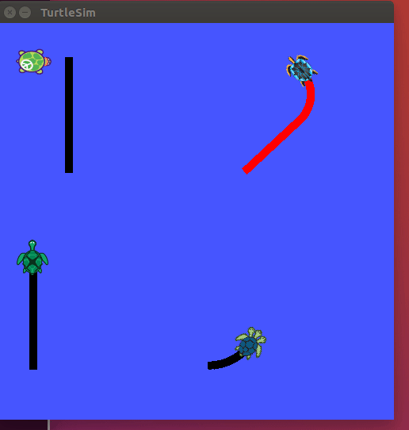

 
 
# I-Love-ROS       

## Overview 
Visualize the Turtles writing "I ♡ ROS". [Turtlesim Package](http://wiki.ros.org/turtlesim) is used to run turtlesim node, call turtlesim services, etc. All the commands are compiled in a shell executable files to run the program all at once

## Directory Structure

                                          .
                                          ├── CMakeLists.txt
                                          ├── launch
                                          │   └── turtle.launch
                                          ├── LICENSE
                                          ├── package.xml
                                          ├── README.md
                                          └── scripts
                                              ├── heart.sh
                                              ├── i_love_ros.sh
                                              ├── i.sh
                                              ├── o.sh
                                              ├── r.sh
                                              └── s.sh


## Result


## How to Use
1. Clone repo to `/home/workspace/src`. Then, compile the code:
```
cd /home/workspace/
catkin_make
source devel/setup.bash
```
2. To see turtles working, enter the following commands:
```
cd scripts
./i_love_ros.sh
```
